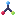
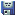
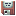
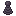
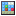

# NibblePoker's Random Graphics
Small collection of random graphics that can be used freely in your projects
without any restrictions.

**More icons and images will be added here as time goes on.**

## Upscaling
The following upscalers are recommended:
* [Lospec's Pixel Art Upscaler](https://lospec.com/pixel-art-scaler/)
* [irokaru's pixel-scaler](https://irokaru.github.io/pixel-scaler/)
* [maxlaumeister's XBR Pixel Art Upscaler](https://www.maxlaumeister.com/pixel-art-upscaler/)

## Sets

### 16x set #1

## License
The images in this repository are licensed under [CC0 1.0 Universal (CC0 1.0) (Public Domain)](LICENSE).
